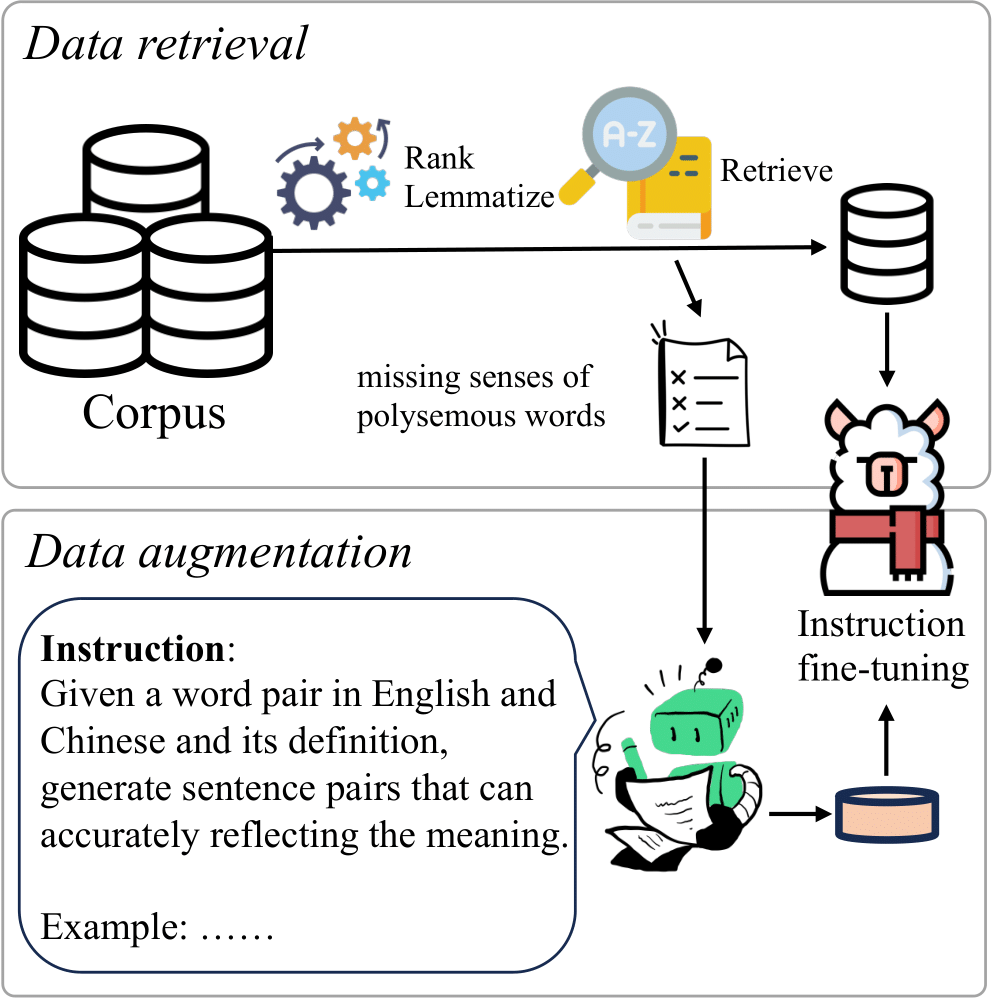

# Lexmatcher-MT

<p align='center'>

</p>


We present LexMatcher, a simple yet effective method for data curation, the design of which is driven by the coverage of senses found in bilingual dictionaries. 
The construction process comprises data retrieval from an existing corpus and data augmentation that supplements the infrequent senses of polysemous words. 
Utilizing various LLMs as the backbones, our method outperforms the established baselines on the WMT2022 test sets and also exhibits remarkable performance in tasks related to word sense disambiguation and specialized terminology translation. 


### Collected Translation Data for Supervised Fine-tuning(SFT)

Languages: Chinese-English, German-English, Russian-English

https://huggingface.co/datasets/Lemoooon/Lexmt_SFT/tree/main

The dictionaries used for data collection are placed in the ''bidicts''.


### SFT code

https://github.com/lemon0830/TIM


### Fine-tuning Models

<table><tbody>
<!-- START TABLE -->
<!-- TABLE HEADER -->
<th valign="bottom"></th>
<th valign="bottom">base</th>
<th valign="bottom">model</th>
<!-- TABLE BODY -->
<tr><td align="left">LexMatcher-2B</a></td>
<td align="center">Gemma-2B</td>
<td align="center"><a href="https://huggingface.co/Lemoooon/LexMatcher_2B">download</a></td>
<tr><td align="left">LexMatcher-7B</a></td>
<td align="center">LLaMA2-7B</td>
<td align="center">todo</td>
<tr><td align="left">LexMatcher-8B</a></td>
<td align="center">LLaMA3-8B</td>
<td align="center"><a href="https://huggingface.co/Lemoooon/LexMatcher_8B">download</td>
<tr><td align="left">LexMatcher-13B</a></td>
<td align="center">LLaMA2-13B</td>
<td align="center"><a href="https://huggingface.co/Lemoooon/LexMatcher_13B">download</a></td>
</tbody></table>


### Please kindly cite our paper if you find it helpful:
```
@Article{yin2024lexmatcher,
  author  = {Yongjing Yin, Jiali Zeng, Yafu Li, Fandong Meng, Yue Zhang},
  title   = {LexMatcher: Dictionary-centric Data Curation for LLM-based Machine Translation},
  journal = {arXiv preprint arXiv:2406.01441},
  year    = {2024},
}
```

