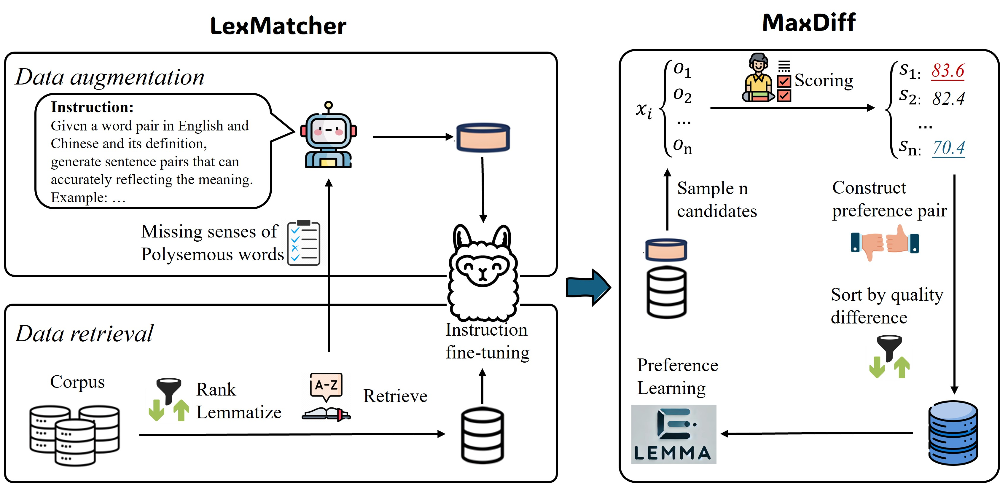

# Lexmatcher-MT

<p align='center'>

</p>


We present LEMMA, derived from further optimizing the Latcher model on preference data constructed by MaxDiff, 
surpass the previous state-of-the-art model ALMA-R, which relies on GPT-4 to provide additional translations, while our method is purely based on sampling from our own models;


### Collected Translation Data for Supervised Fine-tuning(SFT)

Languages: Chinese-English, German-English, Russian-English

https://huggingface.co/datasets/Lemoooon/Lexmt_SFT/tree/main


The dictionaries used for data collection are placed in the ''bidicts''.
### SFT code

https://github.com/lemon0830/TIM

### MaxDiff code

https://github.com/ARIES-LM/Lexmatcher-MT/tree/LEMMA/MaxDiff

### Fine-tuning Models

<table><tbody>
<!-- START TABLE -->
<!-- TABLE HEADER -->
<th valign="bottom"></th>
<th valign="bottom">base</th>
<th valign="bottom">model</th>
<!-- TABLE BODY -->
<tr><td align="left">LexMatcher-2B</a></td>
<td align="center">Gemma-2B</td>
<td align="center"><a href="https://huggingface.co/Lemoooon/LexMatcher_2B">download</a></td>
<tr><td align="left">LexMatcher-7B</a></td>
<td align="center">LLaMA2-7B</td>
<td align="center"><a href="https://huggingface.co/yongjing/LexMatcher_7B">download</td>
<tr><td align="left">LexMatcher-8B</a></td>
<td align="center">LLaMA3-8B</td>
<td align="center"><a href="https://huggingface.co/Lemoooon/LexMatcher_8B">download</td>
<tr><td align="left">LexMatcher-13B</a></td>
<td align="center">LLaMA2-13B</td>
<td align="center"><a href="https://huggingface.co/Lemoooon/LexMatcher_13B">download</a></td>
<tr><td align="left">LEMMA-7B</a></td>
<td align="center">LexMatcher-7B</td>
<td align="center"><a href="https://huggingface.co/ZixuanANDJiaBao/LEMMA-7B">download</a></td>
<tr><td align="left">LEMMA-13B</a></td>
<td align="center">LexMatcher-13B</td>
<td align="center"><a href="https://huggingface.co/ZixuanANDJiaBao/LEMMA-13B">download</a></td>
</tbody></table>


### Please kindly cite our paper if you find it helpful:
```
@Article{yin2024lexmatcher,
  author  = {Yongjing Yin, Jiali Zeng, Yafu Li, Fandong Meng, Yue Zhang},
  title   = {LexMatcher: Dictionary-centric Data Curation for LLM-based Machine Translation},
  journal = {arXiv preprint arXiv:2406.01441},
  year    = {2024},
}
```

